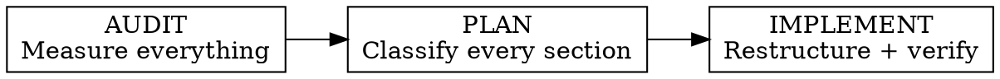
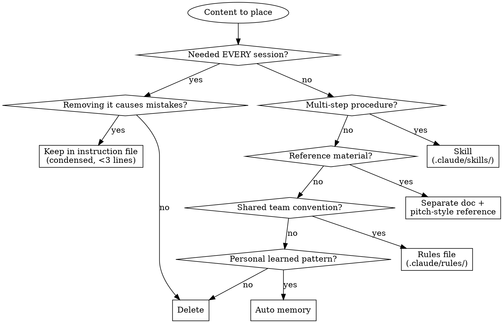

# Instruction File Cleanup

Restructure bloated instruction files (CLAUDE.md, AGENTS.md, Cursor rules, etc.) to restore agent performance. Follows a three-phase cycle: **Audit** the full instruction surface area, **Plan** where each piece of content should live, **Implement** the restructuring with verification.

## Why This Matters

Instruction files are a **prompt budget**, not documentation. Every line loads into the agent's context window and competes for attention with the actual task. Research shows instruction-following degrades uniformly as instruction count rises — bloated files don't just waste the middle, they degrade adherence everywhere.

## The Three Phases



Work through each phase completely before moving to the next. Do NOT jump to restructuring without measuring first.

---

## Phase 1: Audit

Measure the full instruction surface area — everything that loads into the agent's context.

### What to measure

For each item, count lines and estimate characters:

1. **All CLAUDE.md / AGENTS.md files** — walk the directory tree. Note which are ancestors (load at launch) vs subdirectory (load lazily on demand).
2. **@-imports** — find all `@path/to/file` references in instruction files. These expand at launch and are hidden context cost. Measure what they expand to.
3. **MEMORY.md** — first 200 lines or 25KB load every session. Check current line count. Topic files (in the memory directory) load on demand — note their existence but don't count them as always-loaded.
4. **`.claude/rules/` files** — rules without `paths:` frontmatter load at launch. Path-scoped rules load when matching files are opened.
5. **Skill descriptions** — always in context (budget: ~1% of context window, fallback 8,000 chars). Each description capped at 1,536 chars.

### Produce the Context Budget Report

```
## Context Budget Report

| Source | Location | Lines | Est. Chars | Loading |
|--------|----------|-------|------------|---------|
| Root CLAUDE.md | ./CLAUDE.md | ??? | ??? | Always |
| Frontend CLAUDE.md | ./frontend/CLAUDE.md | ??? | ??? | Always (ancestor) or Lazy |
| @-import: README | @README.md | ??? | ??? | Always (expands at launch) |
| MEMORY.md | ~/.claude/projects/.../MEMORY.md | ??? | ??? | First 200 lines |
| Rule: testing.md | .claude/rules/testing.md | ??? | ??? | Always (no paths: filter) |
| ...  | ... | ... | ... | ... |
| **TOTAL always-loaded** | | **???** | **???** | |

Target: each file under 200 lines. Combined always-loaded budget: as small as possible.
```

Present this report to the user before proceeding to Phase 2.

---

## Phase 2: Plan

For every section in every instruction file, apply the **litmus test** and route it to the right destination.

### The Litmus Test

For each section, ask: **"Would removing this cause the agent to make mistakes?"**

- **Yes** — it stays in the instruction file (but condensed)
- **No** — it gets extracted, moved, or deleted

### The Content Router



### Destination Guide

| Destination | What goes here | Loading behavior |
|---|---|---|
| **Instruction file (CLAUDE.md)** | Facts the agent needs every session: build commands, critical rules, architectural decisions, key gotchas | Always loaded. Survives compaction (root only). |
| **Skill (.claude/skills/)** | Multi-step procedures: deployment, migration, debugging workflows, testing playbooks | Description always in context (~1,536 chars). Body loads only when invoked. |
| **Separate doc + reference** | Reference material: route tables, component catalogs, API docs, env var tables, schema docs, code examples | Never loaded automatically. Agent reads on demand. |
| **Rules (.claude/rules/)** | Shared conventions scoped to file types: "when editing *.tsx, follow these patterns" | Unconditional rules load at launch. Path-scoped rules load on file match. |
| **Auto memory** | Personal learned patterns, workflow preferences, feedback corrections | First 200 lines of MEMORY.md load every session. Topic files load on demand. |
| **Delete** | Content the agent can derive from code: file trees, version numbers, standard conventions, self-evident practices | Never existed in context. |

### Reference Technique: Pitch-Style Pointers

When extracting content to a separate doc, leave a **conditional reference** — not a bare path.

```markdown
# BAD — bare path (agent doesn't know WHEN to read it)
- Route table: `docs/routes.md`

# GOOD — pitch-style reference (tells agent when to look)
- Before adding or modifying a route -> `docs/routes.md`
- When creating a React component -> `docs/components.md`
- Before deploying -> `docs/deployment.md`
```

The pitch-style reference tells the agent both WHAT exists and WHEN to read it — a conditional trigger, not a bibliography entry.

### @-Import Warning

**@-imports (`@path/to/file.md`) expand at launch** — they are NOT lazy. Every @-imported file loads into context on every session, even when irrelevant. Use plain pitch-style references instead:

```markdown
# BAD — expands at launch, burns context every session
@docs/api-reference.md

# GOOD — agent reads on demand only when needed
- Before calling a backend endpoint -> `docs/api-reference.md`
```

Reserve @-imports only for short files (<30 lines) that genuinely apply to every session (e.g., importing a shared AGENTS.md).

### Compaction Survival Rule (IMPORTANT for monorepos)

Content in the **root instruction file** survives compaction — it is re-read from disk and re-injected after `/compact`. Content in **subdirectory instruction files** is NOT re-injected — it reloads only when the agent next reads a file in that directory.

**Critical rules must live in the root file, not subdirectory files.** If a rule matters enough that forgetting it mid-session would cause damage, it belongs in the root. When your restructuring plan moves content between files, always ask: "If `/compact` runs and this file doesn't reload, would the agent make a dangerous mistake?" If yes, keep it in root.

### Produce the Restructuring Plan

For each section, state:

| Section | Current | Action | Destination | Condensed Version |
|---|---|---|---|---|
| Route table | 60 lines | Extract | `docs/routes.md` | "Before adding routes -> `docs/routes.md`" |
| Build commands | 15 lines | Keep, condense | Instruction file | (3 essential commands) |
| ... | ... | ... | ... | ... |

**Include a verification section in the plan.** List 5-10 key terms you will grep for after restructuring to confirm nothing was lost. This is part of the plan, not an afterthought.

**Flag compaction-critical content.** In your plan table, mark any rule that must survive compaction with "(root only)" in the Destination column. If a critical rule currently lives in a subdirectory file, the plan must move it to root.

Present this plan to the user and get approval before implementing.

---

## Phase 3: Implement

Execute the approved plan, then verify nothing was lost.

### Implementation Order

1. **Create extracted docs first** — write the files that content is moving to
2. **Create skills** — write SKILL.md files for procedures being extracted
3. **Rewrite the instruction file** — condense kept content, add pitch-style references, remove extracted content
4. **Clean up memory** — if MEMORY.md was flagged in audit, move misplaced content to instruction files or rules

### Verification: The Needle Grep

After restructuring, verify that key concepts are still reachable. Pick 5-10 important terms from the original file and grep for them:

```bash
# Can the agent still find routing info?
grep -r "route" docs/ CLAUDE.md .claude/

# Can it find the deployment procedure?
grep -r "deploy" .claude/skills/ docs/

# Is the critical pitfall still inline?
grep "getSession" CLAUDE.md
```

If a key term is unreachable (not in any instruction file, doc, skill, or code), something was lost. Fix it before committing.

### Target Metrics

| Metric | Target |
|---|---|
| Lines per instruction file | Under 200 |
| Code blocks in instruction files | 0 (extract to docs or skills) |
| Large tables (10+ rows) | 0 (extract to docs) |
| @-imports of large files | 0 (convert to pitch-style references) |
| MEMORY.md line count | Well under 200, with headroom for growth |

---

## Quick Reference: Content Types

| Content type | Belongs in instruction file? | Why / where instead |
|---|---|---|
| Build/test commands | Yes (condensed) | Agent can't guess non-standard commands |
| Critical gotchas | Yes (one line each) | Prevents specific mistakes |
| Architectural decisions | Yes (brief "X not Y because Z") | Prevents agent from suggesting rejected alternatives |
| Key conventions | Yes (condensed) | Coding standards that differ from defaults |
| Full route/component tables | No | Extract to doc — agent reads code directly |
| Env var tables | No | Use `.env.example` with comments |
| Code pattern examples | No | Extract to doc — agent reads actual source |
| Database schema docs | No | Agent reads schema files directly |
| API endpoint docs | No | Agent reads route files directly |
| Deployment walkthroughs | No | Move to skill (it's a procedure) |
| Testing playbooks | No | Move to skill (beyond basic test command) |
| Version numbers | No | Agent reads package.json / lockfiles |
| File-by-file descriptions | No | Agent uses file tools to explore |
| Standard language conventions | No | Agent already knows these |

## Common Mistakes

1. **Skipping the audit** — Restructuring without measuring leads to "feels smaller" but no actual context reduction. Measure first.
2. **Using @-imports for extracted content** — Defeats the entire purpose. Use pitch-style plain references.
3. **Leaving all pitfalls in docs** — Critical gotchas (ones that cause CI failures or data loss) MUST stay inline. Only extract the less severe ones.
4. **Not considering skills** — Deployment procedures, testing workflows, and debugging playbooks are verbs, not nouns. They belong in skills, not docs.
5. **Forgetting compaction** — Critical rules in subdirectory files get lost after `/compact`. Put them in root.
6. **Not verifying** — The needle grep catches content that was extracted but never referenced. Always verify.
7. **One-shot restructuring** — This should be a conversation: audit -> present -> plan -> approve -> implement -> verify. Not a single commit.
8. **Planning without a verification list** — The plan itself must include which terms you'll grep for post-restructuring. If the plan doesn't mention verification, the implementation won't do it either.
