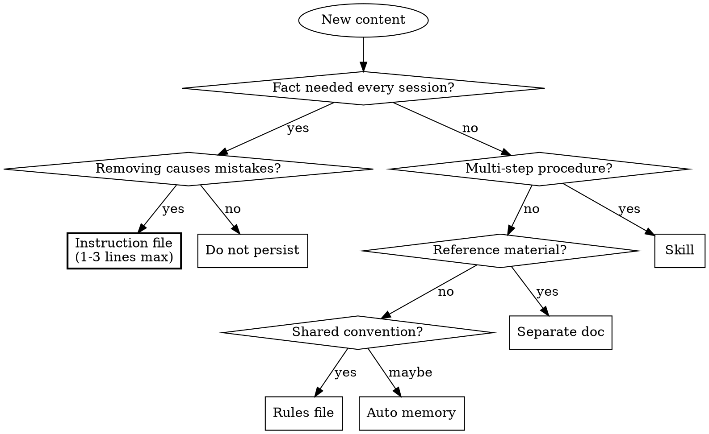

# Instruction Guardian

A decision framework for routing content into the right destination and preventing re-bloat of instruction files.

**Violating the letter of this skill is violating the spirit of it.** If you find yourself reasoning that "this specific case is different" or "the skill didn't literally anticipate my situation, so the rule doesn't apply," stop — that reasoning is the failure mode this skill exists to catch.

## When This Activates

You are about to call `Edit` or `Write` on:
- `CLAUDE.md` or `AGENTS.md` — **at any path depth**: the root file, or any nested instance (`**/CLAUDE.md`, `**/AGENTS.md`). Common layouts include `apps/*/CLAUDE.md`, `packages/*/AGENTS.md`, `services/*/CLAUDE.md`, but the trigger applies to any subdirectory location regardless of repo structure.
- `MEMORY.md` (append, update, or insert)
- Memory topic files under `.claude/**/memory/` (e.g. `~/.claude/projects/<project-id>/memory/feedback_*.md`, `project_*.md`, `reference_*.md`, `user_*.md`). These store the detailed content that `MEMORY.md` indexes — they are part of the auto-memory surface area and route by the same rules.
- Any file under `.claude/rules/`
- An `@-import` reference in any of the above

Or the user says:
- "add this to CLAUDE.md" / "document in AGENTS.md" / "update the agent instructions"
- "remember this" / "note this in the rules"

**STOP.** Run the checklist below before writing anything — **regardless of edit size**. A 1-line tweak, flag addition, typo fix, or appended list item all trigger the same checklist as a full rewrite.

### Exception: approved `instruction-cleanup` Phase-3 plans

The **one** carve-out. When you are executing Edits that implement an already-approved `instruction-cleanup` Phase-3 plan, skip the per-Edit guardian checklist. Phase 2 of `instruction-cleanup` already applies the same litmus test ("would removing this cause the agent to make mistakes?"), routes each section through an equivalent flowchart, and has been explicitly approved by the user — that IS the guardian pass, done in batch form.

**The carve-out is mechanized by a flag file.** When `instruction-cleanup` Phase-3 begins, it creates a per-project flag in the system tmpdir; the `PreToolUse` hook checks for this flag and suppresses the reminder; Phase-3's last step removes the flag. The flag is intentionally outside the repo, so neither `.gitignore` nor commits ever need to mention it. In normal Phase-3 flow the carve-out happens automatically — you do not need to reason about it.

The bullets below are a **safety net** for cases the flag does not cover: hook disabled, flag missing because the cleanup skill was bypassed, an unusual conversation state, or a deviation discovered mid-implementation. In all of those, your judgment falls back to this checklist.

This exception is narrow:

- The plan must be **approved by the user in the current conversation** — not merely drafted or proposed.
- The Edit must match the plan as approved.
- **Approval must be unambiguous and item-specific.** If the user's response is hedged, partial, or scoped to a subset ("the rest is fine, let me think about X", "looks good overall", "start with the easy ones if you want"), only the **explicitly approved items** enter the carve-out. Every non-approved item still triggers guardian. When in doubt: not approved.
- **Any deviation triggers guardian normally** — scope creep, new sections the plan didn't cover, ad-hoc additions discovered mid-implementation, or content you decide to keep/move differently than the plan said. A deviating Edit should disarm the flag first (run the disarm snippet from `instruction-cleanup`'s "Final step"), or accept that the hook will not fire for it.
- "I'm doing cleanup-ish work" is NOT the exception. The exception requires an explicit Phase-2 plan on record in this conversation.

For anything else — routine edits, multi-file fix sweeps, typo fixes, single-line tweaks — the full checklist still runs.

### Rationalizations to catch in yourself

*Applies to routine/ad-hoc edits. If you are inside an approved Phase-3 plan (see the Exception above), the carve-out controls — these rows describe bypasses for edits that are NOT part of such a plan.*

| Rationalization | Reality |
|---|---|
| "It's just N lines / a typo / one character" | Size is not the trigger. The trigger is the file. Run the checklist. |
| "I'm mid fix-sweep, this is just another file" | Instruction files have different health constraints than source files. Fix-mode doesn't exempt them. |
| "The subdirectory CLAUDE.md is less important than root" | Subdirectory instruction files still load in their scope and still re-bloat over time. Run the checklist. |
| "I already invoked the guardian earlier in this session" | Each edit is a separate routing decision. Past approval of a different edit does not transfer. |
| "The user explicitly told me to edit this file" | User tells you *what* they want; the guardian decides *where it belongs*. Explicit instruction does not bypass routing. |
| "The user said skip the checklist" | Acknowledge, then run it anyway — it costs seconds. If the guardian agrees the content belongs, you've lost nothing; if it doesn't, you've avoided a re-bloat commit. |
| "I've mentally walked through this already" | Mental checklist ≠ running the skill. Future edits skip the stored reasoning. |
| "The deploy/meeting/deadline is in N minutes" | The checklist takes seconds. Deadline pressure is exactly when skipped process steps become incidents. |
| "Guardian would obviously say yes — skipping saves a step" | Predicting the answer ≠ running the checklist. Predictions are wrong often enough that the seconds saved are not worth the routing miss. |
| "The rule can't have meant *this* edit" | The rule meant every edit. Constructing the exception IS the failure mode the spirit-vs-letter clause exists to catch. |

---

## The Pre-Write Checklist

Before adding ANY content to an instruction file, answer these six questions in order:

### 1. How many lines is the file right now?

Check the current line count. If the file is already at or near the threshold, new content must be especially justified.

| File type | Threshold | Action if over |
|---|---|---|
| CLAUDE.md / AGENTS.md | 200 lines | Do NOT add. Extract or condense existing content first. |
| MEMORY.md | 200 lines (hard limit — content past line 200 is invisible) | Move detailed content to topic files before adding. |
| `.claude/rules/` file | No hard limit, but keep each file focused | Split into multiple files if growing large. |

**If adding this content would push the file over the threshold, you must extract or condense something else first.** Never add to an over-threshold file without removing at least as much.

### 2. Is this already documented somewhere?

Before adding anything, check if the content (or equivalent) already exists in:
- The instruction file itself (duplicate entries degrade signal)
- Another instruction file at a different level (root vs subdirectory)
- A doc, skill, or rules file that already covers this topic
- The source code (comments, config files, `.env.example`)

If it's already documented, do NOT add it again. Duplication is worse than absence — it creates conflicting sources of truth.

### 3. Does removing this cause the agent to make mistakes?

This is the litmus test (from official Anthropic guidance). Apply it literally:

- "The agent would use `getSession()` instead of `getUser()` without this" — **Yes, add it.**
- "The agent wouldn't know our preferred test runner" — **Yes, add it.**
- "The agent wouldn't know the full Stripe checkout flow" — **No.** The agent can read the code.
- "The agent wouldn't know all our API endpoints" — **No.** The agent can read route files.

If the answer is no, the content does NOT belong in an instruction file. Route it elsewhere.

### 4. Where does this content belong?



### 5. Is the format correct for the destination?

Each destination has format rules:

**Instruction file (CLAUDE.md / AGENTS.md):**
- One line per entry, two lines maximum
- No code blocks (extract to docs or skills)
- No tables over 5 rows (extract to docs)
- No full examples (extract to docs)
- Use "X not Y because Z" format for architecture decisions
- New references must use pitch-style: "Before doing X -> `path/to/doc.md`"

**Skill (.claude/skills/):**
- For procedures with 3+ steps
- Frontmatter (name + description) under 1024 chars total; aim for description under ~500 chars
- Description is just triggers, NOT the workflow (workflow summaries create shortcuts that agents follow instead of reading the skill body)
- Body loads only when invoked — can be detailed

**Separate doc:**
- For reference material the agent reads on demand
- Must be referenced from instruction file with a pitch-style pointer
- "Before adding a route -> `docs/routes.md`" (NOT just "`docs/routes.md`")

**Rules file (.claude/rules/):**
- For conventions scoped to file types
- Use `paths:` frontmatter to limit when they load
- One topic per file

**Auto memory:**
- For personal learned patterns and preferences
- Keep MEMORY.md as a concise index — details go in topic files
- Not for team-shared knowledge (use rules or instruction files instead)

### 6. Are you creating an @-import?

**@-imports expand at launch.** They load into context every session regardless of relevance.

```
NEVER create an @-import unless:
- The imported file is under 30 lines AND
- The content genuinely applies to every session AND
- There is no other way to share the content (e.g., importing AGENTS.md)
```

In almost all cases, use a pitch-style plain reference instead.

---

## When the User Asks You to "Add This to CLAUDE.md"

The user may explicitly ask you to add content that doesn't belong in an instruction file. **You should push back politely and suggest the right destination.** You are a guardian of the instruction file's health.

**How to push back:**

> "I'd rather not add this directly to CLAUDE.md — at [current line count] lines, we're [near/over] the 200-line target, and this [content type] would be better as [destination]. Here's what I'd do instead:
>
> - [Specific routing suggestion]
> - [One-liner for CLAUDE.md if applicable]
>
> Want me to do that?"

**When to comply anyway:** If the user insists after you've explained the tradeoff, comply — but condense the content as much as possible and note the line count impact.

---

## Condensation Patterns

When content does belong in an instruction file, condense it aggressively:

**Gotchas/pitfalls — one line each:**
```markdown
# BAD (4 lines)
## Authentication
When using the auth middleware, always use `getUser()` instead of 
`getSession()`. The `getSession()` function doesn't verify JWT 
signatures with the auth server, which is a security risk.

# GOOD (1 line)
- Auth middleware: use `getUser()`, not `getSession()` — only `getUser()` verifies JWTs server-side
```

**Architecture decisions — "X not Y because Z":**
```markdown
# BAD (3 lines)
We chose Prisma as our ORM. We evaluated Drizzle but decided against 
it because Prisma has a more mature migration system and the generated 
types work well with our TypeScript setup.

# GOOD (1 line)
- Prisma over Drizzle: mature migrations, Prisma Studio, generated types
```

**Procedures — route to skill, leave pointer:**
```markdown
# BAD (15 lines of deployment steps in CLAUDE.md)

# GOOD (0 lines in CLAUDE.md — skill auto-discovers)
# Create .claude/skills/deploy/SKILL.md with the full procedure
```

---

## Anti-Patterns to Catch

When you see these patterns being added to an instruction file, intervene:

| Pattern | Problem | Route to |
|---|---|---|
| Full code block (>5 lines) | Burns context every session | Separate doc or inline in source |
| Table with 10+ rows | Reference material, not instructions | Separate doc |
| Step-by-step procedure | Procedure = verb = skill | `.claude/skills/` |
| API endpoint list | Agent reads route files | Separate doc (if needed at all) |
| Env var table | Agent reads `.env.example` | `.env.example` with comments |
| File tree | Agent uses file tools | Delete (or `docs/structure.md` for humans) |
| Version numbers | Change frequently, agent reads package files | Delete |
| Full configuration example | Reference material | Separate doc or inline in config |
| "For more details, see @large-file.md" | @-import expands at launch | Use pitch-style plain reference |
| Content duplicating what's in code | Agent can read the code | Delete |
